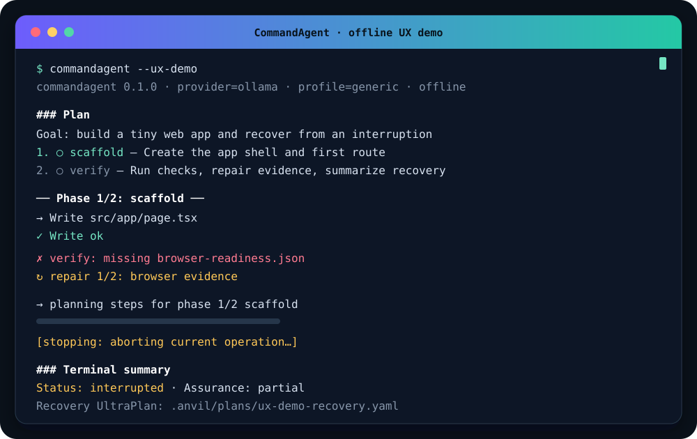

<!-- Translation pair: README.md and README.ja.md must always be updated together. -->

[English](README.md) | [日本語](README.ja.md)

# CommandAgent

[](https://github.com/Kewton/CommandAgent/actions/workflows/ci.yml)
[](https://opensource.org/license/mit)

**A local-first coding agent that turns a goal into verified code through a
minimal loop or structured plans.**

CommandAgent works inside a trusted local workspace, uses Ollama, Gemini, or
OpenAI as its model provider, and keeps implementation tied to verification.
Start with a single prompt, generate a reusable YAML plan, or let an UltraPlan
break a larger goal into phases and repair failures along the way.

## Demo

<p align="center">
  
</p>

The demo is completely offline: run `commandagent --ux-demo`. See the
[recording notes](docs/assets/ux-demo.md) to reproduce it.

## Features

- **Minimal loop** — inspect, edit, run tools, and verify in a direct iterative
  coding loop.
- **Step plans** — create or execute YAML step plans with `--plan-steps`,
  `--plan-run`, and `--run-plan`.
- **UltraPlan runs** — split larger goals into phases with `--ultra-plan`,
  `--ultra-plan-run`, and `--run-ultra-plan`.
- **Task profiles** — use `generic`, `nextjs`, `python-cli`, or `data` guidance
  and verification contracts.
- **Multiple providers** — run locally with Ollama or connect to Gemini and
  OpenAI.
- **Verification and repair** — check claimed results, collect evidence, and
  feed failures into bounded repair loops.
- **Interactive TUI** — get a fixed status footer, activity spinner, streaming
  output, queued input, and Esc/Ctrl-C interruption.

## Quickstart

This is the shortest local-only path. It sends nothing to a remote model
provider.

1. [Install Ollama](https://ollama.com/download) and make sure it is running.
2. Pull a model that fits your machine:

   ```bash
   ollama pull "<your-model>"
   ```

3. From the CommandAgent source directory, install the binary:

   ```bash
   cargo install --path .
   ```

4. Move to a trusted project and run one prompt:

   ```bash
   cd /path/to/your/project
   commandagent --provider ollama --model "<your-model>" \
     --prompt "Inspect this project and suggest one useful improvement."
   ```

`<your-model>` is a placeholder, not a literal model ID. Replace it with a
model that actually exists in your local `ollama list` output.

## Install

### Prerequisites

| Requirement | Needed for |
| --- | --- |
| Rust 1.88 or newer | Building and installing CommandAgent |
| Ollama (optional) | Local model execution |
| `GEMINI_API_KEY` or `OPENAI_API_KEY` (optional) | Gemini or OpenAI execution |
| Node.js and npm (optional) | Installing and running the interaction probe |
| Python 3 (optional) | Evaluation tooling and Python-oriented checks |

### From source

```bash
git clone https://github.com/Kewton/CommandAgent.git
cd CommandAgent
cargo install --path .
commandagent --help
```

A prerequisite helper at `scripts/setup.sh` is planned in a separate issue.
This section will link to that script when it is available; the script is not
present yet.

For remote providers, set the corresponding key in the process environment or
in `.env` at the active workspace root. CommandAgent redacts these values from
logs.

## Usage

Start the interactive REPL with a local model:

```bash
commandagent --provider ollama --model "<your-model>"
```

Run the minimal loop once without entering the REPL:

```bash
commandagent --provider ollama --model "<your-model>" \
  --prompt "Add a focused test for the parser edge case."
```

Generate and run a step plan:

```bash
commandagent --provider ollama --model "<your-model>" \
  --plan-run --profile python-cli "Build a small JSON formatting CLI."
```

Generate and run a phased UltraPlan:

```bash
commandagent --provider ollama --model "<your-model>" \
  --ultra-plan-run --profile nextjs "Build a small task board."
```

Use a remote provider after setting its API key:

```bash
export GEMINI_API_KEY="<your-api-key>"
commandagent --provider gemini --model "<gemini-model>" \
  --prompt "Review the current diff."

export OPENAI_API_KEY="<your-api-key>"
commandagent --provider openai --model "<openai-model>" \
  --prompt "Review the current diff."
```

Inside the REPL, start with these slash commands:

| Command | Purpose |
| --- | --- |
| `/help` | Show every available slash command |
| `/status` | Show effective configuration and readiness |
| `/plan-run <goal>` | Generate and run a step plan |
| `/ultra-plan-run <goal>` | Generate and run an UltraPlan |
| `/runs` | List recent runs and recovery availability |
| `/resume [run-id\|yaml-path]` | Resume from a recovery UltraPlan |
| `/exit` or `/quit` | Leave the TUI |

See the [user guide](docs/guide/README.md) for the full CLI and REPL reference.
The executable remains the source of truth: use `commandagent --help` and
`/help` to inspect the installed version.

## Configuration

Named presets can be stored in either of these canonical files:

- `.commandagent/config.toml` in the active workspace
- `~/.commandagent/config.toml` in the user's home directory

The matching `.anvil/config.toml` files remain supported as legacy fallbacks.
CommandAgent reads these files but does **not** create them or populate presets
automatically. Live run, plan, and repair artifacts continue to use their
existing `.anvil/` paths.

A preset is selected with `commandagent --preset <name>`. See the
[configuration guide](docs/guide/README.md#configuration) for the supported
fields and precedence rules.

## Development and security

Repository maintainers can find UAT, release-build, symlink, live-provider, and
copy-validation procedures in
[docs/dev/repository-validation.md](docs/dev/repository-validation.md). Codex
harness details live in [docs/codex-harness.md](docs/codex-harness.md).

CommandAgent is intended for trusted workspaces and trusted goals. Read
[SECURITY.md](SECURITY.md) before using `--yes` or running unfamiliar project
code.

## License

CommandAgent is licensed under the MIT License, as declared in
[Cargo.toml](Cargo.toml).
