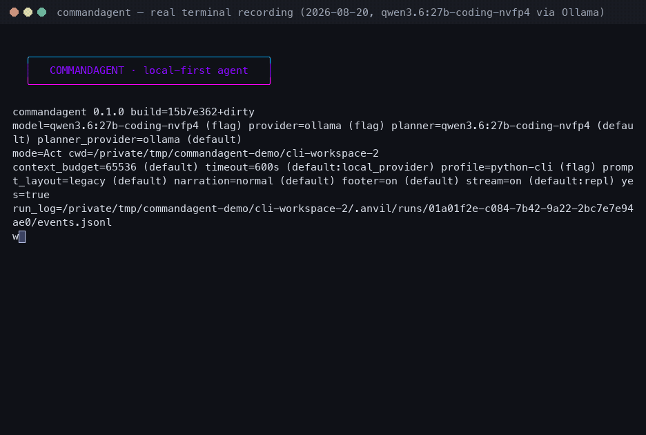
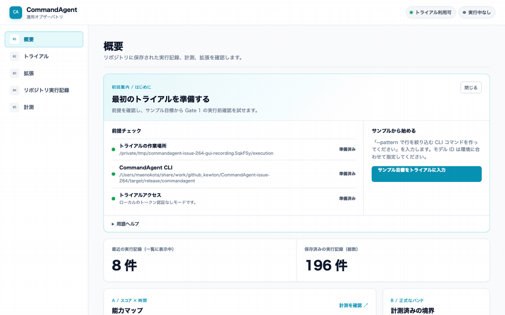

<!-- Translation pair: README.md and README.ja.md must always be updated together. -->

[English](README.md) | [日本語](README.ja.md)

# CommandAgent

[](https://github.com/Kewton/CommandAgent/actions/workflows/ci.yml)
[](https://opensource.org/license/mit)

**A local-first coding agent that turns a goal into verified code through a
minimal loop or structured plans.**

CommandAgent works inside a trusted local workspace, uses Ollama, LM Studio,
Gemini, or OpenAI as its model provider, and keeps implementation tied to verification.
Start with a single prompt, generate a reusable YAML plan, or let an UltraPlan
break a larger goal into phases and repair failures along the way.

## Demo

Both recordings below are real screens captured from this repository's build
(`commandagent 0.1.0`, commit `15b7e362`, 2026-08-20) running against a local
Ollama model. Nothing is staged or edited: the REPL output, the Gate 1 card,
the phase progress, and the final verdict are what the binary produced. Only
the pacing is changed — idle gaps are shortened and the running phases are
played as a time-lapse.

**CLI — a request in the REPL, the Gate 1 card, `/confirm`, and the run**

<p align="center">
  
</p>

**GUI — one delegated Trial from the management GUI**

<p align="center">
  
</p>

The GUI **Overview** is the product landing page: **Goal -> pre-execution
confirmation -> plan/implement -> verify/repair -> verified result or honest
failure**. It explains local-first operation, Gate 1, bounded writes, evidence,
and the [four extension layers](docs/guide/en/extensions.md) before showing live
readiness and active-session data. Start at `/try/`, watch an active session at
`/try/status/`, find sessions at `/try/history/`, and read terminal evidence at
`/try/history/detail/`. Capability maps/bands and repository-run lists remain
on their owning **Measurements** and **Repository run records** pages.

The [recording notes](docs/assets/ux-demo.md) explain how both GIFs were
captured and how to regenerate them with `scripts/demo/`. The
[tutorial](docs/guide/en/tutorial.md) walks through the same screens step by
step. `commandagent --ux-demo` still exists as a completely offline, scripted
walkthrough; it contacts no provider and is not a provider-backed run.

## Features

- **Minimal loop** — inspect, edit, run tools, and verify in a direct iterative
  coding loop.
- **Step plans** — create or execute YAML step plans with `--plan-steps`,
  `--plan-run`, and `--run-plan`.
- **UltraPlan runs** — split larger goals into phases with `--ultra-plan`,
  `--ultra-plan-run`, and `--run-ultra-plan`.
- **Task profiles** — use `generic`, `nextjs`, `python-cli`, or `data` guidance
  and verification contracts.
- **Multiple providers** — run locally with Ollama or LM Studio, or connect to
  Gemini and OpenAI.
- **Verification and repair** — check claimed results, collect evidence, and
  feed failures into bounded repair loops.
- **Interactive TUI** — get a fixed status footer, activity spinner, streaming
  output, queued input, Esc/Ctrl-C interruption, terminal-title phase progress,
  and a completion bell for long-running commands.

## Quickstart

This is the shortest local-only path. It sends nothing to a remote model
provider.

1. [Install Ollama](https://ollama.com/download) and make sure it is running.
2. Pull a model that fits your machine:

   ```bash
   ollama pull "<your-model>"
   ```

3. From the CommandAgent source directory, install the binary:

   ```bash
   cargo install --path .
   ```

4. Move to a trusted project and start the REPL:

   ```bash
   cd /path/to/your/project
   commandagent --provider ollama --model "<your-model>"
   ```

5. At `commandagent>`, type a request as plain text:

   ```text
   commandagent> Create a CLI --pattern filter command
   ```

   CommandAgent shows a Gate 1 card but does not execute yet. Review the request,
   write boundary, models, and required checks. Then copy the card's exact hash
   into the command it shows:

   ```text
   commandagent> /confirm sha256:<card-hash>
   ```

   Replace `<card-hash>` with the value on your card. `/confirm` persists that
   exact confirmation and starts the run.

`<your-model>` is a placeholder, not a literal model ID. Replace it with a
model that actually exists in your local `ollama list` output.

Follow the CLI learning path in order; every layer is linked from the previous
one:

1. [Getting started](docs/user/getting-started-cli.md) — provider, config,
   offline doctor, and the first Gate 1 confirmation
2. [Detailed tutorial](docs/guide/en/tutorial.md) — a 20-minute walkthrough
   with real screens through Gate 1–4 and one GUI Trial
3. [CLI reference](docs/guide/en/cli-reference.md) — every public flag,
   default, and conflict

Other entry points:

- [GUI getting started](docs/user/getting-started-gui.md) — setup readiness,
  sample Trial, Gate 1, separate status/history/result pages, and the copyable
  working directory (isolated per session by default, or an existing relative
  directory selected below `--execution-root`)
- [Extensions](docs/guide/en/extensions.md) — four layers, pack/profile supply,
  bounded draft-profile registration, assurance boundaries, and the path from
  a private extension to review;
  [detailed lifecycle](docs/user/gui-extensions.md)

## Install

### Prerequisites

| Requirement | Needed for |
| --- | --- |
| Rust 1.88 or newer | Building and installing CommandAgent |
| Ollama (optional) | Local model execution |
| LM Studio (optional) | Local OpenAI-compatible model execution |
| `GEMINI_API_KEY` or `OPENAI_API_KEY` (optional) | Gemini or OpenAI execution |
| Node.js and npm (optional) | Installing and running the interaction probe |
| Python 3 (optional) | Evaluation tooling and Python-oriented checks |

### From source

```bash
git clone https://github.com/Kewton/CommandAgent.git
cd CommandAgent
cargo install --path .
commandagent --help
```

### Prebuilt release binary

Install a verified macOS or Linux x86_64 binary without a Rust toolchain:

```bash
curl -fsSL https://raw.githubusercontent.com/Kewton/CommandAgent/main/scripts/install.sh | sh
# safer: download scripts/install.sh, inspect it, then run `sh install.sh`
```

The installer verifies SHA-256 and installs to `~/.local/bin`; use `--version`
or `--prefix` to customize it. Piping a remote script has supply-chain risks.
Unlike this binary download, `scripts/setup.sh` builds from source and prepares
the development environment. crates.io metadata is prepared and checked with
`cargo publish --dry-run`, but nothing is published; confirm the package name,
included files, and irreversible yank policy before publishing. A future
`Kewton/homebrew-tap` formula is proposed after releases stabilize; no external
tap repository is created here.

For guided prerequisite checks, installation, and optional provider/probe
setup, run `./scripts/setup.sh`. Use `--yes` for non-interactive safe defaults
or `--check-only` to inspect prerequisites without changing anything.

Operators can build and preflight the [management GUI](docs/user/gui-setup.md) with
`./scripts/setup.sh --gui`. Add `--write-config --extension-root <dir>` to
create a private extension skeleton and an example
[business preset](docs/guide/en/configuration.md#presets) without overwriting an
existing config.

For OpenAI, set `OPENAI_API_KEY` only in the launching process environment.
Gemini may use the process environment or `.env` at the active workspace root.
When LM Studio server authentication is enabled, set the optional
`LM_STUDIO_API_TOKEN` in the launching process environment. CommandAgent
redacts these values from logs.

## Usage

Start the interactive REPL with a local model:

```bash
commandagent --provider ollama --model "<your-model>"
```

Use a model visible to an LM Studio server:

```bash
lms server start
commandagent --provider lm-studio --model "<lm-studio-model-id>" \
  --lm-studio-host http://localhost:1234
```

Run the minimal loop once without entering the REPL:

```bash
commandagent --provider ollama --model "<your-model>" \
  --prompt "Add a focused test for the parser edge case."
```

Generate and run a step plan:

```bash
commandagent --provider ollama --model "<your-model>" \
  --plan-run --profile python-cli "Build a small JSON formatting CLI."
```

Generate and run a phased UltraPlan:

```bash
commandagent --provider ollama --model "<your-model>" \
  --ultra-plan-run --profile nextjs "Build a small task board."
```

Use a remote provider after setting its API key:

```bash
export GEMINI_API_KEY="<your-api-key>"
commandagent --provider gemini --model "<gemini-model>" \
  --prompt "Review the current diff."

export OPENAI_API_KEY="<your-api-key>"
commandagent --provider openai --model "<openai-model>" \
  --prompt "Review the current diff."
```

Inside the REPL, start with these slash commands:

| Command | Purpose |
| --- | --- |
| `/help` | Show every available slash command |
| `/confirm <hash>` | Confirm the reviewed Gate 1 card and start its run |
| `/status` | Show effective configuration and readiness |
| `/plan-run <goal>` | Generate and run a step plan |
| `/ultra-plan-run <goal>` | Generate and run an UltraPlan |
| `/runs` | List recent runs and recovery availability |
| `/resume [run-id\|yaml-path]` | Resume from a recovery UltraPlan |
| `/exit` or `/quit` | Leave the TUI |

See the [user guide](docs/guide/README.md) for the full CLI and REPL reference.
Browse the [documentation index](docs/README.md) for contributor contracts,
validation procedures, and historical records.
The executable remains the source of truth: use `commandagent --help` and
`/help` to inspect the installed version.

## Configuration

Named presets can be stored in either of these canonical files:

- `.commandagent/config.toml` in the active workspace
- `~/.commandagent/config.toml` in the user's home directory

The matching `.anvil/config.toml` files remain supported as legacy fallbacks.
CommandAgent reads these files but does **not** create them or populate presets
automatically. New runs, plans, repairs, and evidence use the matching
`.commandagent/` subdirectories, and default session state uses the platform
`commandagent` state directory. Existing `.anvil/` runtime inputs and
`anvilminimal` session state remain readable during migration.

A preset is selected with `commandagent --preset <name>` and may use one
`extends` parent plus `${ENV_NAME}` references. See the
[configuration guide](docs/guide/en/configuration.md) for the supported
fields and precedence rules.

## Development and security

Repository maintainers can find UAT, release-build, symlink, live-provider, and
copy-validation procedures in
[docs/dev/repository-validation.md](docs/dev/repository-validation.md). Codex
harness details live in [docs/codex-harness.md](docs/codex-harness.md).

CommandAgent is intended for trusted workspaces and trusted goals. Read
[SECURITY.md](SECURITY.md) before using `--yes` or running unfamiliar project
code.

## License

CommandAgent is licensed under the [MIT License](LICENSE).
