# Issue 78 design: Trial one-screen/one-state layout

## Decision and scope

The Trial page will render one active workflow state at a time. A compact,
read-only step indicator remains above that state for orientation, but completed
forms and cards are removed from the layout rather than accumulated below it.

This patch is presentation-only:

- keep every existing Trial API method, path, request body, and response body;
- keep the explicit Gate 1 checkbox, `proposal.card_hash` dispatch value, and
  server-side exact-hash enforcement unchanged;
- keep existing `data-testid` values and add only layout-oriented IDs;
- keep CLI-only delegation, event projection, polling, D-3d hashing, and the
  absence of cancel/override controls unchanged;
- do not merge, cherry-pick, or copy predecessor histories. The layout is made
  as a narrow wrapper/conditional-rendering change so later dependency-order
  integration can place predecessor cards inside the matching active state.

## Predecessor review

The committed predecessor summaries and changed-file sets were inspected before
this design. The layout must leave room for these state-local additions:

| Issue | Contract that the layout preserves |
| --- | --- |
| 63, 80 | Gate 2 polling/reconnect and 200/304 monitoring state stay inside the execution state. |
| 64, 71 | Workspace lease and session index are read-only compose/recovery information; they do not become dispatch controls. |
| 66 | Launch identity remains locked during execution; 終了状態には後で既存の新規実行 reset を配置できる。 |
| 67 | Server-derived profile/provider/model controls remain in the compose state with their stable test IDs. |
| 68, 69 | Gate 2 phase status, elapsed time, phase x/N, and measured mean are the execution state's primary feedback. |
| 70 | Recent events and artifact browsing remain Gate 2/Terminal read-only actions. |
| 72 | Machine-coded error guidance and reconnect links stay in the state where the failed action occurred. |
| 73 | Server-provided Gate 1 markdown, the exact confirmation ID, Terminal result copy, and D-3d semantics remain intact. |
| 76 | 日本語固定・i18n 非導入を承認済み判断として継承する。新設する stepper の表示は日本語にし、既存コピーの広範な翻訳は重複実装しない。 |
| 77 | Mobile stage targets retain scroll refs and must clear the sticky header. |
| 79 | Token persistence is out of scope; the current token transport and storage behavior are unchanged. |

## State transition

```mermaid
stateDiagram-v2
    [*] --> 依頼
    依頼 --> 確認: POST session-proposals 成功
    確認 --> 依頼: 起動条件を変更
    確認 --> 実行: 明示確認 + 同一 hash; POST sessions 成功
    実行 --> 結果: 投影 gate が gate_3 または gate_4
    結果 --> 実行: D-3d 継続を確認
    結果 --> 終了: 追加実行なしで終了
    終了 --> 依頼: predecessor #66 統合後の新規実行

    note right of 依頼
      目標/token/profile/provider/model
      主操作: 契約を確認
    end note
    note right of 確認
      固定契約 + 計測価格
      主操作: 明示確認して委譲
    end note
    note right of 実行
      現在 phase/進捗のみ
      介入操作なし
    end note
    note right of 結果
      D-3d 操作を先に表示; 結果も閲覧可能
    end note
```



At any point the DOM contains the compact step indicator and only the active
state from the diagram. The `proposal`, `created`, and `session` objects remain
in React memory for the existing requests, but inactive visual states are not
rendered.

## PC wires

### 依頼

```text
┌ Trial 画面見出し ───────────────────────────────────────────────┐
├ 依頼 ─ 確認 ─ 実行 ─ 結果（現在位置を強調）─────────────────────┤
├───────────────────────────────────────────┬─────────────────────┤
│ 目標 + token                              │ profile / provider  │
│                                          │ executor / planner  │
├───────────────────────────────────────────┴─────────────────────┤
│                                  [契約と価格を確認]             │
└─────────────────────────────────────────────────────────────────┘
```

### 確認

```text
┌ Trial 画面見出し ───────────────────────────────────────────────┐
├ 依頼 ─ 確認 ─ 実行 ─ 結果                                      ┤
├ 固定契約 / filesystem 境界 ────────────┬─ 計測価格 ────────────┤
│ 確認項目と正確な意味                    │ rate、時間、費用、n   │
│                                         ├───────────────────────┤
│                                         │ □ 同一内容を明示確認  │
│                                         │ [CLI に委譲]          │
└─────────────────────────────────────────┴───────────────────────┘
```

### 実行

```text
┌ Trial 画面見出し ───────────────────────────────────────────────┐
├ 依頼 ─ 確認 ─ 実行 ─ 結果                                      ┤
├ Gate 2 / session / monitor 状態 ────────────────────────────────┤
│ 現在 phase 行と状態内の read-only feedback                      │
├ events path / event 数 / predecessor の read-only viewer ──────┤
└─────────────────────────────────────────────────────────────────┘
```

### 結果と終了

```text
┌ Trial 画面見出し ───────────────────────────────────────────────┐
├ 依頼 ─ 確認 ─ 実行 ─ 結果                                      ┤
├ Terminal 結果 / evidence ───────────────┬─ D-3d 次の操作 ──────┤
│ Gate 3/4 と acceptance sheet            │ 追加指示 + 確認       │
│                                         │ または追加実行せず終了│
└─────────────────────────────────────────┴───────────────────────┘

┌ 終了 ───────────────────────────────────────────────────────────┐
│ 追加実行なし。#66 の新規実行操作はここへ統合される。            │
└─────────────────────────────────────────────────────────────────┘
```

## 390px wires

検証対象 viewport は 390 × 844 CSS pixel とする。既存の下部 navigation は
4.65rem のまま維持する。依頼と確認では、その上に状態固有の主操作 bar を
固定し、利用者が scroll しなくても主ボタンを表示する。契約を読むための
active state 自体は scroll できる。

### 依頼

```text
┌ 390px ───────────────────────────┐
│ 簡潔な shell / Trial 見出し      │
├ 依頼 · 確認 · 実行 · 結果 ─────┤
│ 依頼                            │
│ 目標                            │
│ token                           │
│ profile / provider / models     │
│                                 │
├ □ 主操作領域 ──────────────────┤  下部 nav の上に固定
│ [契約と価格を確認]              │  初期表示で可視
├ 概要 · 実行履歴 · Trial · … ───┤
└─────────────────────────────────┘
```

### 確認

```text
┌ 390px ───────────────────────────┐
│ 簡潔な shell / Trial 見出し      │
├ 依頼 · 確認 · 実行 · 結果 ─────┤
│ 確認                            │
│ 固定契約 / 境界                 │  scroll 可能な閲覧領域
│ 計測価格 / exact hash           │
│                                 │
├ □ 同一契約を確認 ───────────────┤  下部 nav の上に固定
│ [確認して CLI に委譲]           │  初期表示で可視
├ 概要 · 実行履歴 · Trial · … ───┤
└─────────────────────────────────┘
```

### 実行

```text
┌ 390px ───────────────────────────┐
│ 簡潔な shell / Trial 見出し      │
├ 依頼 · 確認 · 実行 · 結果 ─────┤
│ Gate 2 / 状態                   │
│ session id                      │
│ 現在 phase と進捗               │  主 feedback を viewport 内に表示
│ events / read-only viewer       │
├ 概要 · 実行履歴 · Trial · … ───┤
└─────────────────────────────────┘
```

### 結果と終了

```text
┌ 390px ───────────────────────────┐
│ 簡潔な shell / Trial 見出し      │
├ 依頼 · 確認 · 実行 · 結果 ─────┤
│ D-3d 次の操作                   │  長い結果より先に配置
│ 追加指示                        │
│ [除去して保存] [終了]           │  主操作を viewport 内に表示
├ Gate 3/4 結果 / evidence ───────┤
├ 概要 · 実行履歴 · Trial · … ───┤
└─────────────────────────────────┘

┌ 390px ───────────────────────────┐
│ 終了の確認                       │
│（#66 の新規実行操作を配置）      │
└─────────────────────────────────┘
```

## Implementation shape

1. Replace the accumulated unconditional sections in `gui/app/try/page.tsx`
   with one compact stepper plus mutually exclusive state sections.
2. Split Gate 1 price information from its explicit confirmation actions so
   only the small action area becomes fixed at the 390px breakpoint.
3. Use CSS grid areas to keep verdict-left/action-right on PC and action-first
   on mobile without duplicating Terminal controls.
4. Extend `smoke.mjs` with layout assertions at 390 × 844 while preserving the
   existing real two-base-path flow and test IDs.
5. Add a focused source-contract test that pins mutual exclusion, the mobile
   action bar, Terminal ordering, and the unchanged confirmation/hash boundary.

## Design review

- Reviewed on 2026-08-16 against the Issue 78 acceptance criteria: **approved
  for implementation**.
- 390px review: 依頼と確認の主ボタンはナビゲーション上に固定し、実行は
  live progress、結果は D-3d 操作から始まる。
- Language review: #78 が新設する stepper/wire のラベルは
  「依頼・確認・実行・結果・終了」とし、#76 の日本語固定・i18n 非導入判断を
  継承する。API/event/hash/opaque ID は翻訳しない。
- Contract review: no API, event, hash, confirmation requirement, or existing
  `data-testid` change is designed.
- Integration review: predecessor state-local components have explicit landing
  states and no predecessor commit is included in this branch.
