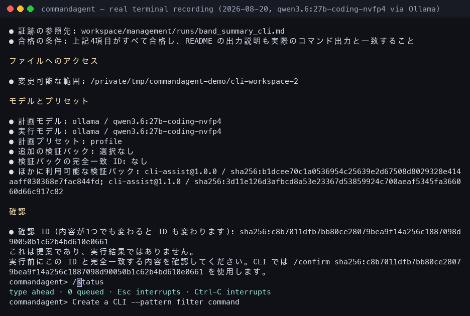
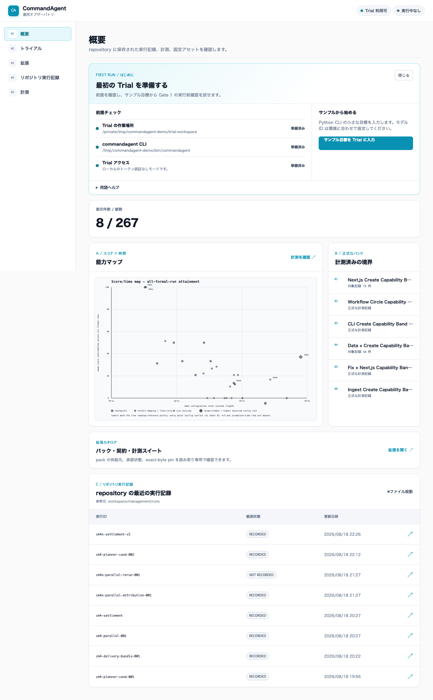
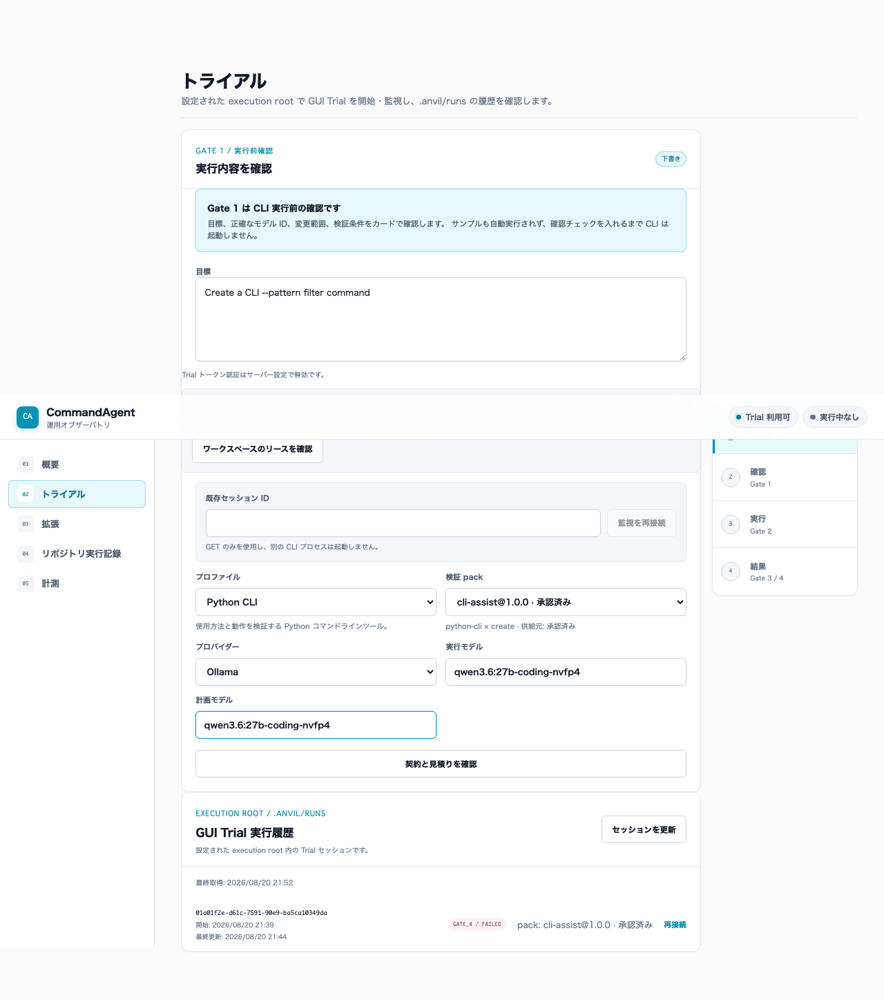
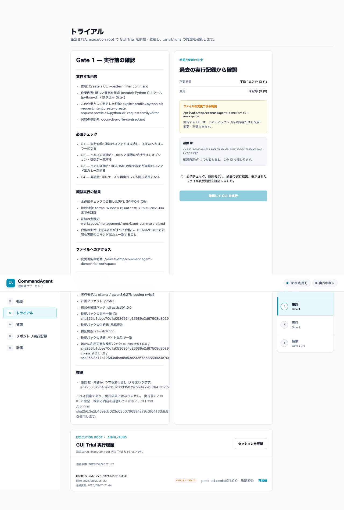
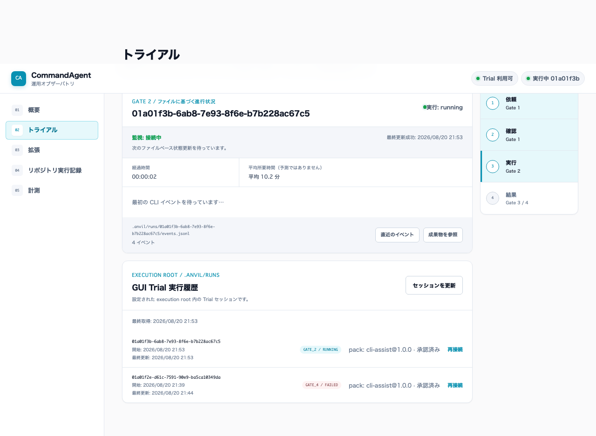
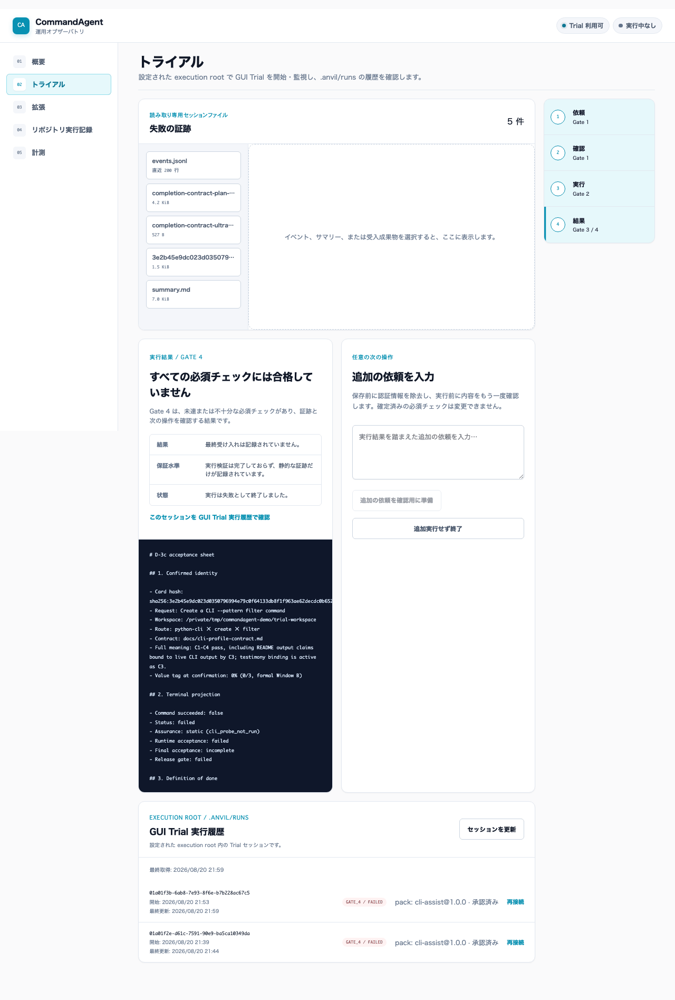
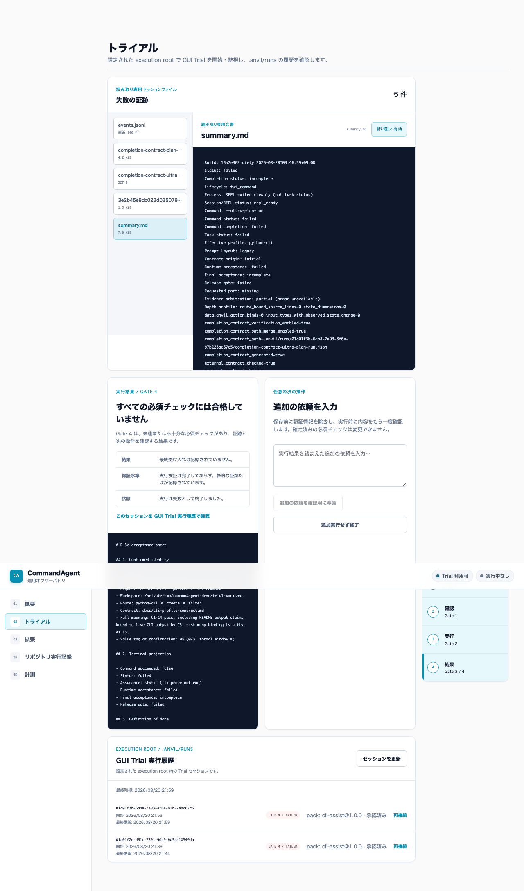

# Tutorial: your first run, in the terminal and in the GUI

[日本語版](../ja/tutorial.md) | [CLI getting started](../../user/getting-started-cli.md)
| [CLI reference](cli-reference.md) | [GUI getting started](../../user/getting-started-gui.md)

This walkthrough takes about 20 minutes and uses only real screens: every
terminal excerpt and screenshot below was captured from this repository's
build (`commandagent 0.1.0`, commit `15b7e362`) running a local Ollama model.
Your model will answer differently, so your plan, phases, and verdict will
differ; the flow and the screens stay the same.

## Before you start

### What you need

- A built or installed `commandagent` (`cargo install --path .` or
  [`scripts/install.sh`](../../../scripts/install.sh)).
- A running Ollama with at least one pulled model. The terminal recording
  uses the product default `qwen3.6:27b-coding-nvfp4`; the doctor excerpt
  below was taken with `qwen3.8:27b-mlx`. Replace either with an exact ID from
  your `ollama list`.
- An empty, throwaway Git repository to work in. CommandAgent edits files in
  the directory you start it from, so never start it in a checkout you care
  about until you have read the [security model](../../../SECURITY.md).

```bash
mkdir -p ~/commandagent-tutorial && cd ~/commandagent-tutorial
git init -q && git commit -q --allow-empty -m "empty workspace"
```

### What this tutorial does not do

It does not explain configuration files, presets, or packs in depth, and it
does not cover remote providers. Those are in the
[CLI getting started](../../user/getting-started-cli.md) and the
[configuration guide](configuration.md).

## Step 1 — Check your setup with `--doctor`

`--doctor` tells you, before any model is called, whether the binary, the
provider, and the workspace are ready. Run it from the throwaway workspace:

```bash
commandagent --provider ollama --model "<your-model>" --doctor
```

This is real output from the recording machine (paths shortened):

```text
CommandAgent doctor: warnings
✓ Model                  qwen3.8:27b-mlx (source=CLI; detail=flag)
✓ Provider               ollama (source=CLI; detail=flag)
✓ Planner model          qwen3.8:27b-mlx (source=default; detail=default)
✓ Planner provider       ollama (source=default; detail=default)
✓ Profile                generic (source=default; detail=default)
✓ Config file            .../cli-workspace/.commandagent/config.toml: not found (optional)
✓ Pack selection         no pack selected
✓ Ollama                 http://localhost:11434/api/tags reachable; 24 model tag(s)
✓ Ollama executor model  qwen3.8:27b-mlx is present in /api/tags
✓ Ollama planner model   qwen3.8:27b-mlx is present in /api/tags
✓ Playwright probe       playwright 1.61.1 available (managed_interaction_probe)
! TTY                    stdin=false, stdout=false, stderr=false
  Remediation: run from an interactive terminal when validating TUI behavior
✓ Workspace              .../cli-workspace is writable (temporary file created and removed)
✓ Workspace .env         .../cli-workspace/.env is not present
```

Read the two model lines first: the planner model defaults to the executor
model unless you pass `--planner-model`. A `!` line is a warning with a
remediation; an `✗` line must be fixed before you continue. The `TTY` warning
above only appears because the doctor was run from a script, not a terminal.

## Step 2 — Your first request in the REPL

### Start the REPL

```bash
commandagent --provider ollama --model "<your-model>" --profile python-cli
```

The banner shows exactly which model, provider, profile, and workspace are in
effect, where the event log for this session is written, and the one-line
status footer that stays pinned to the bottom of the terminal:

```text
  ╭──────────────────────────────────────╮
  │   COMMANDAGENT · local-first agent   │
  ╰──────────────────────────────────────╯

commandagent 0.1.0 build=15b7e362
model=qwen3.6:27b-coding-nvfp4 (flag) provider=ollama (flag) planner=qwen3.6:27b-coding-nvfp4 (default) planner_provider=ollama (default)
mode=Act cwd=/private/tmp/commandagent-demo/cli-workspace-2
context_budget=65536 (default) timeout=600s (default:local_provider) profile=python-cli (flag) ...
run_log=/private/tmp/commandagent-demo/cli-workspace-2/.commandagent/runs/<run-id>/events.jsonl
start: plain-text request → review Gate 1 → /confirm <hash> | help: /help
[act] provider:ollama model:qwen3.6:27b-coding-nvfp4 ctx:65536 tokens:n/a
commandagent>
```

`/status` prints the same facts at any time, and `/help` lists every slash
command. The full recording of this step is the CLI GIF in the
[README](../../../README.md#demo).

### Type the request and read the Gate 1 card

Type the goal as a plain sentence. Do not start with a slash command; the
boundary shell turns a plain request into a **Gate 1 card** and waits:

```text
commandagent> Create a CLI --pattern filter command
```



The card is rendered in Japanese by the product. Its sections are always the
same, so you can read it even without the language:

| Section | Meaning |
| --- | --- |
| 実行する内容 | The request, the resolved intent/profile/family, and the contract it is bound to. |
| 必須チェック | The checks (`C1`–`C4` for `python-cli`) that must pass for a full verdict. |
| 類似実行の結果 | How many comparable recorded runs passed all checks, and the evidence path. |
| ファイルへのアクセス | The only directory the run may change. |
| モデルとプリセット | Planner/executor models, preset, and any pinned verification pack. |
| 確認 | The card hash. Any change to the card changes this hash. |

Nothing has been executed yet. If the card does not describe what you meant,
do not confirm it; type a corrected request and a new card appears.

### Confirm and watch the run

The last line of the card tells you the exact command. Copy the hash from your
screen — the value below is from the recording and will not match yours:

```text
commandagent> /confirm sha256:<card-hash>
```

The REPL answers `Persisted confirmation` and `Dispatching python-cli × create
× filter.`, then the phased `ultra-plan` run starts. The footer shows the
current phase, the step inside it, the running tool, and the total/provider
time; `Esc` interrupts and leaves a recovery plan behind. In the recording the
planner produced three phases — `project-scaffolding`, `core-filter-logic`,
and `edge-cases-and-validation` — and each one ended with its own `✓ verify`
lines. The whole run took about 11 minutes on the recording machine; a
smaller model or a shorter goal finishes sooner.

### Read the result

When the run ends, the REPL prints the **D-3c acceptance sheet** and returns
to the prompt. Its `Terminal projection` block is the part to read, and it
deliberately keeps three facts apart:

1. **Status** — did the command finish (`completed`) or stop (`failed`,
   `interrupted`)?
2. **Acceptance** — `Runtime acceptance` and `Final acceptance` report whether
   the plan's own checks passed (`full_success` in the recording).
3. **Assurance** — how much independent verification actually ran. `static
   (cli_probe_not_run)` means the CLI behaviour probe did not execute, so only
   static evidence exists.

The gate is derived from all three. This is why the recording ends with
`Gate 4 — Failure and next action` even though the command completed and the
final acceptance was `full_success`: without the probe, the result cannot be
called a full `Gate 3`. The sheet then lists the `Typed next actions` that are
available — `retry`, `elevated_model`, `pack_change`, `human_directive`, or
`close` — and never upgrades the verdict on its own.

Type `/exit` to leave. The next section shows where all of this is persisted.

## Step 3 — The same flow from the GUI

The management GUI does not talk to a model itself. It shows you the same
Gate 1 card, then delegates the identical CLI run into a separate
**execution root** and projects its event log back into the browser.

### Start gui_server

Build the static export once and start the server with three disjoint
directories: the repository (read-only evidence), an execution root (the only
place the delegated CLI may write), and an extension root (private packs).
Full details are in [GUI setup](../../user/gui-setup.md).

```bash
cd gui && GUI_BASE_PATH=/ npm run build && cd ..
cargo run --features gui --bin gui_server -- \
  --port 4173 --base-path / --static-dir gui/out \
  --repository-root . \
  --execution-root /path/to/trial-workspace \
  --extension-root /path/to/commandagent-extensions \
  --trial-token-auth off \
  --commandagent-bin target/release/commandagent
```

Add `--check` to the same command to run the preflight without binding a
port; it prints `ok`/`ng` per item, including whether the three roots are
disjoint and whether the extension root is private (`0700`).

### The first-run card

Open `http://127.0.0.1:4173/`. The **はじめに** card at the top of the overview
repeats the doctor's three GUI-relevant checks — the execution root, the CLI
binary, and Trial access — and offers a sample goal:



### Sample goal and Gate 1

**サンプル目標を Trial に入力** opens the Trial page with the same goal as
Step 2, the `python-cli` profile, and an admitted verification pack
(`cli-assist@1.0.0`) pre-selected. It deliberately leaves both model fields
empty; type the exact model ID into **実行モデル** and **計画モデル**.



**契約と見積りを確認** asks the server for the Gate 1 card. It is the same
card as in the terminal, plus a right-hand column with the measured mean
duration of comparable runs, the writable directory, and the card hash. The
run button stays disabled until you tick the confirmation checkbox:



### Gate 2: watch the delegated run

After **確認して CLI を実行** the page switches to the Gate 2 view. Two things
are shown separately on purpose: the **execution state** (`running`, the
phase list rebuilt from `events.jsonl`) and the **monitoring health**
(`接続中` / `不安定` / `切断`). If your browser loses the server, the CLI keeps
running; reload the page and use **監視を再接続** with the session ID from the
URL. After reconnect, elapsed time continues from the session start and the
measured mean matches the value shown before launch.



### Result and history

At the end the page shows the verdict, the assurance level, and the process
status as three separate facts, lets you open `summary.md`, the event tail,
and the confirmation record, and offers an optional follow-up request that
goes through its own confirmation:



Every GUI-launched session is listed under **GUI Trial 実行履歴** on the same
page, with its pack pin and a reconnect link:



## Step 4 — Where the evidence lives

Both paths write to the workspace they ran in, never to the repository:

| Path (under the workspace) | Content |
| --- | --- |
| `.commandagent/runs/<run-id>/events.jsonl` | Every event of the run, one JSON object per line. The GUI's phase list and the REPL footer are projections of this file. |
| `.commandagent/runs/<run-id>/summary.md` | Status, verdict, assurance, `Stop reason`, `Next action`, and recovery commands. Read this first after a Gate 4. |
| `.commandagent/runs/<run-id>/<card-hash>.json` | The confirmed Gate 1 identity: request, profile, models, pack pin, and the required checks. |
| `.commandagent/plans/`, `.commandagent/repairs/` | Recovery plans and repair prompts that `/resume` and the suggested commands use. |

New runs use `.commandagent/`. Existing `.anvil/runs/<run-id>/` records remain
readable for compatibility and are not rewritten.

`commandagent --summary-json` emits the same terminal facts for scripts; see
[headless summaries](../../user/headless.md).

## If something goes wrong

| You see | What it means | What to do |
| --- | --- | --- |
| `Model ID does not exist` at startup | The ID is not in `ollama list` / the provider catalog. | Use the exact ID; see [troubleshooting](troubleshooting.md#model-id-does-not-exist). |
| `D-3c Gate 1 confirmation is required before execution. Start with a plain-text request, review the Gate 1 card, then enter /confirm <hash>.` | You typed `/ultra-plan-run` or `/plan-run` instead of starting with a request. | Type the request as a plain sentence, review the card, then enter `/confirm <hash>`. |
| Gate 4 with `Assurance: static` | The run stopped before its own verification could run. | Open `summary.md`, read `Stop reason`, then use the printed recovery command or a corrected request. |
| GUI: `Recovery required` lease | A previous delegated run has no terminal event. | Follow the read-only [lease recovery](../../user/gui-trial.md#workspace-lease-inspection-and-recovery); do not delete `.commandagent/` or a legacy `.anvil/` record. |
| GUI: `403 trial_origin_not_allowed` | You reached the server through a different origin than it allows. | Set `GUI_TRIAL_ALLOWED_ORIGINS` to the exact browser origin and restart. |

## Next steps

- Compare two pack versions on the same goal:
  [pack A/B](../../user/getting-started-cli.md#6-compare-one-pack-variable-at-a-time).
- Put your provider and model into a preset so that the command line shrinks
  to `commandagent --preset local_cli`: [configuration](configuration.md#presets).
- Create a private verification pack from the GUI wizard:
  [GUI extensions](../../user/gui-extensions.md#pack-creation-wizard).
- Read the Japanese four-gate walkthrough for the `ingest` profile:
  [first loop](../../user/first-loop.md).
