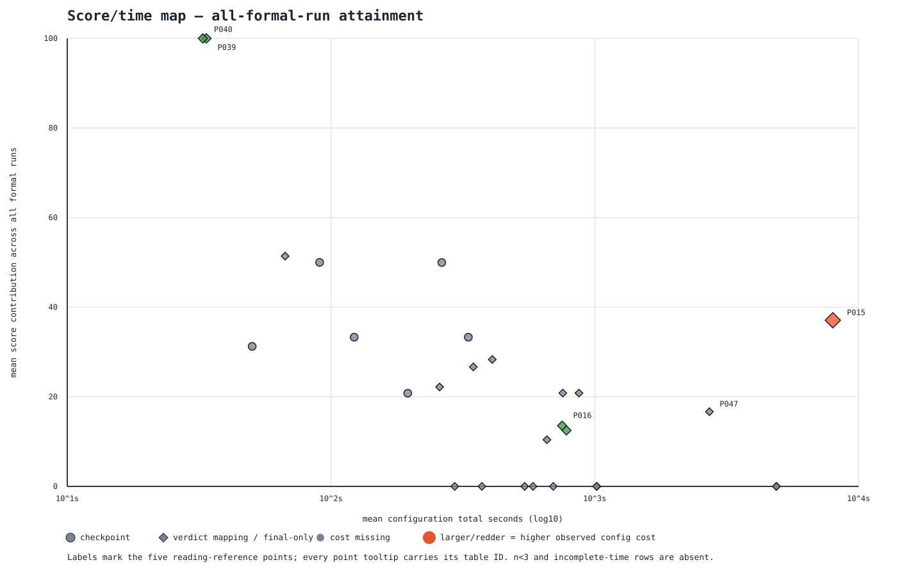

<!-- GENERATED FILE: DO NOT EDIT. -->
# Score/time map

- Schema: `commandagent.score-time-map/v0`
- Regenerate: `python3 workspace/management/scripts/band_aggregate.py --profile score-time-map`
- 手編集禁止。入力証跡または投影器を直して再生成する。既存band summaryは読み取り専用で、地図生成時に書き換えない。

## 定義

- 1点は `(model, profile/family, configuration)`。`single`、`single+fix`、`bon:N`、`directive:roundN#hash`、`pack:id#hash`を別構成として混ぜない。
- 横軸は構成instance総所要の算術平均。単発はrun所要、`single+fix`は原failed run+fix 1周、`bon:N`はN本を時分割実行したcampaign総所要で、SVGは対数軸。縦軸は正式run全数の平均到達寄与。
- 到達済みは保存score、未到達はこの投影だけ0寄与とする。元の遡及vectorの`score=null`は不変で、`reached`分母を併記する。五数要約も同じ全run寄与に対する値。
- `verdict_mapping`（菱形）は歴史final-only 251本とpost-seal最終判定写像、`checkpoint`（丸）はcheckpoint-capable 36本。両者を同一点へ混ぜない。
- n<3は表に残して`n不足`、時間欠落も表に残して非描画。費用は構成instance平均を色とサイズへ写像し、欠測は灰色。
- 点数: 50（描画 29、非描画 21）。run分母: 345（遡及 287 + post-seal 58）。
- 遡及Next.js 78本はaggregate-onlyでrun-level score/timeを同じ分母規律で復元できず、coverage gapとして非投影（n不足の点へ偽装しない）。

## 読み

- cli×Luna/filter は単発 751.8秒・13.54点（n=24）に対し、bon:6 は7987.0秒・37.08点（n=30）で、single+fix は2288.7秒・-4.69点（n=8）。構成時間と全run平均の位置だけを示す。
- ingest×Luna単発は list 33.7秒・100.00点、table 32.7秒・100.00点（各n=3）で右上側に現れる。
- local Breakout bon:6 は 2719.0秒・16.67点（n=6, 構成instance=1）が初出で、single+fix はn=1のため非描画。小分母から優劣は読まない。

## 正準数値表

| ID | 描画 | model | use case | configuration | marker | n | reached | full | instances | mean config sec | time coverage | mean score | min | Q1 | median | Q3 | max | mean cost | cost coverage | Full meaning |
|---|---|---|---|---|---|---:|---:|---:|---:|---:|---:|---:|---:|---:|---:|---:|---:|---:|---:|---|
| P001 | 描画 | gemma4:31b-cloud | circle/elevated | single | verdict_mapping | 24 | 24 | 1 | 24 | 66.96 | 24/24 | 51.40 | 16.7 | 33.3 | 66.7 | 66.7 | 100.0 | N/A | 0/24 | [circle](#full-meaning-circle) |
| P002 | 描画 | qwen3.6:27b-coding-nvfp4 | circle/local | single | verdict_mapping | 9 | 6 | 0 | 9 | 258.00 | 9/9 | 22.20 | 0.0 | 0.0 | 33.3 | 33.3 | 33.3 | N/A | 0/9 | [circle](#full-meaning-circle) |
| P003 | n不足 | gemma4:31b | cli/filter | single | verdict_mapping | 1 | 0 | 0 | 1 | 911.00 | 1/1 | 0.00 | 0.0 | 0.0 | 0.0 | 0.0 | 0.0 | N/A | 0/1 | [cli](#full-meaning-cli) |
| P004 | n不足 | gemma4:31b | cli/stats | single | verdict_mapping | 1 | 0 | 0 | 1 | 1631.00 | 1/1 | 0.00 | 0.0 | 0.0 | 0.0 | 0.0 | 0.0 | N/A | 0/1 | [cli](#full-meaning-cli) |
| P005 | 描画 | gemma4:31b-cloud | cli/filter | bon:6 | verdict_mapping | 3 | 0 | 0 | 1 | 4878.00 | 1/1 | 0.00 | 0.0 | 0.0 | 0.0 | 0.0 | 0.0 | N/A | 0/1 | [cli](#full-meaning-cli) |
| P006 | n不足 | gemma4:31b-cloud | cli/filter | directive:round1#sha256:e868fada3d47b09d1a9226564e214e752d03a3a2da32b77f7addd08bb5850203 | verdict_mapping | 1 | 0 | 0 | 1 | 1510.00 | 1/1 | 0.00 | 0.0 | 0.0 | 0.0 | 0.0 | 0.0 | N/A | 0/1 | [cli](#full-meaning-cli) |
| P007 | n不足 | gemma4:31b-cloud | cli/filter | directive:round2#sha256:55c180bb0fdc86eaa8b219f9aa7c872faae01c974e1d7ccce20ad01c708d2dc4 | verdict_mapping | 1 | 0 | 0 | 1 | 1671.00 | 1/1 | 0.00 | 0.0 | 0.0 | 0.0 | 0.0 | 0.0 | N/A | 0/1 | [cli](#full-meaning-cli) |
| P008 | 描画 | gemma4:31b-cloud | cli/filter | pack:cli-assist@1.0.0#sha256:b1dcee70c1a0536954c25639e2d67508d8029328e414aaff030368e7fac844fd | verdict_mapping | 6 | 2 | 0 | 6 | 756.17 | 6/6 | 20.83 | 0.0 | 0.0 | 0.0 | 46.9 | 62.5 | N/A | 0/6 | [cli](#full-meaning-cli) |
| P009 | 描画 | gemma4:31b-cloud | cli/filter | pack:cli-assist@1.1.0#sha256:3d11e126d3afbcd8a53e23367d53859924c700aeaf5345fa366060d66c917c82 | verdict_mapping | 3 | 1 | 0 | 3 | 871.00 | 3/3 | 20.83 | 0.0 | 0.0 | 0.0 | 31.2 | 62.5 | N/A | 0/3 | [cli](#full-meaning-cli) |
| P010 | 描画 | gemma4:31b-cloud | cli/filter | single | verdict_mapping | 12 | 3 | 0 | 12 | 658.50 | 12/12 | 10.42 | 0.0 | 0.0 | 0.0 | 0.0 | 62.5 | N/A | 0/12 | [cli](#full-meaning-cli) |
| P011 | 描画 | gemma4:31b-cloud | cli/stats | bon:6 | verdict_mapping | 3 | 0 | 0 | 1 | 4878.00 | 1/1 | 0.00 | 0.0 | 0.0 | 0.0 | 0.0 | 0.0 | N/A | 0/1 | [cli](#full-meaning-cli) |
| P012 | 描画 | gemma4:31b-cloud | cli/stats | pack:cli-assist@1.0.0#sha256:b1dcee70c1a0536954c25639e2d67508d8029328e414aaff030368e7fac844fd | verdict_mapping | 6 | 0 | 0 | 6 | 1018.00 | 6/6 | 0.00 | 0.0 | 0.0 | 0.0 | 0.0 | 0.0 | N/A | 0/6 | [cli](#full-meaning-cli) |
| P013 | 描画 | gemma4:31b-cloud | cli/stats | pack:cli-assist@1.1.0#sha256:3d11e126d3afbcd8a53e23367d53859924c700aeaf5345fa366060d66c917c82 | verdict_mapping | 3 | 0 | 0 | 3 | 1015.67 | 3/3 | 0.00 | 0.0 | 0.0 | 0.0 | 0.0 | 0.0 | N/A | 0/3 | [cli](#full-meaning-cli) |
| P014 | 描画 | gemma4:31b-cloud | cli/stats | single | verdict_mapping | 12 | 0 | 0 | 12 | 542.25 | 12/12 | 0.00 | 0.0 | 0.0 | 0.0 | 0.0 | 0.0 | N/A | 0/12 | [cli](#full-meaning-cli) |
| P015 | 描画 | gpt-5.6-luna | cli/filter | bon:6 | verdict_mapping | 30 | 24 | 2 | 5 | 7987.00 | 5/5 | 37.08 | -12.5 | 25.0 | 25.0 | 62.5 | 100.0 | $0.260321 | 5/5 | [cli](#full-meaning-cli) |
| P016 | 描画 | gpt-5.6-luna | cli/filter | single | verdict_mapping | 24 | 6 | 1 | 24 | 751.83 | 24/24 | 13.54 | 0.0 | 0.0 | 0.0 | 0.0 | 100.0 | $0.025442 | 24/24 | [cli](#full-meaning-cli) |
| P017 | 描画 | gpt-5.6-luna | cli/filter | single+fix | verdict_mapping | 8 | 7 | 1 | 8 | 2288.71 | 8/8 | -4.69 | -50.0 | -40.6 | -12.5 | 6.2 | 100.0 | $0.089961 | 8/8 | [cli](#full-meaning-cli) |
| P018 | 描画 | gpt-5.6-luna | cli/stats | single | verdict_mapping | 24 | 4 | 1 | 24 | 780.79 | 24/24 | 12.50 | 0.0 | 0.0 | 0.0 | 0.0 | 100.0 | $0.024564 | 24/24 | [cli](#full-meaning-cli) |
| P019 | n不足 | gpt-5.6-luna | cli/stats | single+fix | verdict_mapping | 1 | 0 | 0 | 1 | 1905.13 | 1/1 | 0.00 | 0.0 | 0.0 | 0.0 | 0.0 | 0.0 | $0.069721 | 1/1 | [cli](#full-meaning-cli) |
| P020 | n不足 | qwen3.6:35b-a3b-coding-nvfp4 | cli/filter | single | verdict_mapping | 2 | 0 | 0 | 2 | 876.00 | 2/2 | 0.00 | 0.0 | 0.0 | 0.0 | 0.0 | 0.0 | N/A | 0/2 | [cli](#full-meaning-cli) |
| P021 | n不足 | qwen3.6:35b-a3b-coding-nvfp4 | cli/stats | single | verdict_mapping | 2 | 0 | 0 | 2 | 772.00 | 2/2 | 0.00 | 0.0 | 0.0 | 0.0 | 0.0 | 0.0 | N/A | 0/2 | [cli](#full-meaning-cli) |
| P022 | n不足 | gemma31 | data/aggregation | single | verdict_mapping | 2 | 0 | 0 | 2 | 227.50 | 2/2 | 0.00 | 0.0 | 0.0 | 0.0 | 0.0 | 0.0 | N/A | 0/2 | [data](#full-meaning-data) |
| P023 | 時間欠落 | gemma4:31b | data/aggregation | single | verdict_mapping | 13 | 6 | 1 | 13 | N/A | 12/13 | -5.77 | -37.5 | -37.5 | 0.0 | 0.0 | 100.0 | N/A | 0/13 | [data](#full-meaning-data) |
| P024 | 描画 | gemma4:31b | data/timeseries | single | verdict_mapping | 4 | 0 | 0 | 4 | 583.50 | 4/4 | 0.00 | 0.0 | 0.0 | 0.0 | 0.0 | 0.0 | N/A | 0/4 | [data](#full-meaning-data) |
| P025 | 描画 | gemma4:31b-cloud | data/aggregation | single | verdict_mapping | 6 | 0 | 0 | 6 | 373.17 | 6/6 | 0.00 | 0.0 | 0.0 | 0.0 | 0.0 | 0.0 | N/A | 0/6 | [data](#full-meaning-data) |
| P026 | 時間欠落 | qwen3.6:35b-a3b-coding-nvfp4 | data/aggregation | single | verdict_mapping | 24 | 7 | 1 | 24 | N/A | 22/24 | 14.58 | -37.5 | 0.0 | 0.0 | 9.4 | 100.0 | N/A | 0/24 | [data](#full-meaning-data) |
| P027 | 描画 | qwen3.6:35b-a3b-coding-nvfp4 | data/timeseries | single | verdict_mapping | 8 | 0 | 0 | 8 | 696.00 | 8/8 | 0.00 | 0.0 | 0.0 | 0.0 | 0.0 | 0.0 | N/A | 0/8 | [data](#full-meaning-data) |
| P028 | 描画 | qwen35 | data/aggregation | single | verdict_mapping | 3 | 0 | 0 | 3 | 294.33 | 3/3 | 0.00 | 0.0 | 0.0 | 0.0 | 0.0 | 0.0 | N/A | 0/3 | [data](#full-meaning-data) |
| P029 | 描画 | gemma4:31b | fix/compile_error_fix | single | checkpoint | 4 | 4 | 1 | 4 | 263.00 | 4/4 | 49.97 | 33.3 | 33.3 | 33.3 | 50.0 | 100.0 | N/A | 0/4 | [fix](#full-meaning-fix) |
| P030 | n不足 | gemma4:31b | fix/compile_error_fix | single | verdict_mapping | 1 | 0 | 0 | 1 | 143.00 | 1/1 | 0.00 | 0.0 | 0.0 | 0.0 | 0.0 | 0.0 | N/A | 0/1 | [fix](#full-meaning-fix) |
| P031 | 描画 | gemma4:31b | fix/contract_hook_fix | single | checkpoint | 7 | 7 | 0 | 7 | 331.57 | 7/7 | 33.30 | 33.3 | 33.3 | 33.3 | 33.3 | 33.3 | N/A | 0/7 | [fix](#full-meaning-fix) |
| P032 | n不足 | gemma4:31b | fix/contract_hook_fix | single | verdict_mapping | 1 | 0 | 0 | 1 | 15.00 | 1/1 | 0.00 | 0.0 | 0.0 | 0.0 | 0.0 | 0.0 | N/A | 0/1 | [fix](#full-meaning-fix) |
| P033 | 描画 | qwen3.6:35b-a3b-coding-nvfp4 | fix/compile_error_fix | single | checkpoint | 5 | 5 | 0 | 5 | 122.40 | 5/5 | 33.30 | 33.3 | 33.3 | 33.3 | 33.3 | 33.3 | N/A | 0/5 | [fix](#full-meaning-fix) |
| P034 | n不足 | qwen3.6:35b-a3b-coding-nvfp4 | fix/compile_error_fix | single | verdict_mapping | 2 | 0 | 0 | 2 | 73.00 | 2/2 | 0.00 | 0.0 | 0.0 | 0.0 | 0.0 | 0.0 | N/A | 0/2 | [fix](#full-meaning-fix) |
| P035 | 描画 | qwen3.6:35b-a3b-coding-nvfp4 | fix/contract_hook_fix | single | checkpoint | 8 | 8 | 0 | 8 | 195.38 | 8/8 | 20.80 | -16.7 | 20.8 | 33.3 | 33.3 | 33.3 | N/A | 0/8 | [fix](#full-meaning-fix) |
| P036 | n不足 | qwen3.6:35b-a3b-coding-nvfp4 | fix/contract_hook_fix | single | verdict_mapping | 2 | 0 | 0 | 2 | 62.50 | 2/2 | 0.00 | 0.0 | 0.0 | 0.0 | 0.0 | 0.0 | N/A | 0/2 | [fix](#full-meaning-fix) |
| P037 | n不足 | gemma4:31b | ingest/list | single | verdict_mapping | 1 | 0 | 0 | 1 | 1448.00 | 1/1 | 0.00 | 0.0 | 0.0 | 0.0 | 0.0 | 0.0 | N/A | 0/1 | [ingest](#full-meaning-ingest) |
| P038 | n不足 | gemma4:31b | ingest/table | single | verdict_mapping | 1 | 0 | 0 | 1 | 830.00 | 1/1 | 0.00 | 0.0 | 0.0 | 0.0 | 0.0 | 0.0 | N/A | 0/1 | [ingest](#full-meaning-ingest) |
| P039 | 描画 | gemma4:31b-cloud | ingest/list | single | verdict_mapping | 24 | 10 | 3 | 24 | 408.46 | 24/24 | 28.33 | 0.0 | 0.0 | 0.0 | 47.5 | 100.0 | N/A | 0/24 | [ingest](#full-meaning-ingest) |
| P040 | 描画 | gemma4:31b-cloud | ingest/table | single | verdict_mapping | 24 | 10 | 1 | 24 | 346.25 | 24/24 | 26.67 | 0.0 | 0.0 | 0.0 | 55.0 | 100.0 | N/A | 0/24 | [ingest](#full-meaning-ingest) |
| P041 | 描画 | gpt-5.6-luna | ingest/list | single | verdict_mapping | 3 | 3 | 3 | 3 | 33.67 | 3/3 | 100.00 | 100.0 | 100.0 | 100.0 | 100.0 | 100.0 | $0.031870 | 3/3 | [ingest](#full-meaning-ingest) |
| P042 | 描画 | gpt-5.6-luna | ingest/table | single | verdict_mapping | 3 | 3 | 3 | 3 | 32.67 | 3/3 | 100.00 | 100.0 | 100.0 | 100.0 | 100.0 | 100.0 | $0.028242 | 3/3 | [ingest](#full-meaning-ingest) |
| P043 | n不足 | qwen3.6:35b-a3b-coding-nvfp4 | ingest/list | single | verdict_mapping | 2 | 0 | 0 | 2 | 771.50 | 2/2 | 0.00 | 0.0 | 0.0 | 0.0 | 0.0 | 0.0 | N/A | 0/2 | [ingest](#full-meaning-ingest) |
| P044 | n不足 | qwen3.6:35b-a3b-coding-nvfp4 | ingest/table | single | verdict_mapping | 2 | 0 | 0 | 2 | 535.00 | 2/2 | 0.00 | 0.0 | 0.0 | 0.0 | 0.0 | 0.0 | N/A | 0/2 | [ingest](#full-meaning-ingest) |
| P045 | n不足 | gemma4:31b | investigation/pipe | single | checkpoint | 2 | 2 | 0 | 2 | 88.00 | 2/2 | 37.50 | 25.0 | 31.2 | 37.5 | 43.8 | 50.0 | N/A | 0/2 | [investigation](#full-meaning-investigation) |
| P046 | n不足 | gemma4:31b | investigation/schema | single | checkpoint | 2 | 2 | 0 | 2 | 305.00 | 2/2 | 50.00 | 50.0 | 50.0 | 50.0 | 50.0 | 50.0 | N/A | 0/2 | [investigation](#full-meaning-investigation) |
| P047 | 描画 | qwen3.6:35b-a3b-coding-nvfp4 | investigation/pipe | single | checkpoint | 4 | 4 | 0 | 4 | 90.50 | 4/4 | 50.00 | 50.0 | 50.0 | 50.0 | 50.0 | 50.0 | N/A | 0/4 | [investigation](#full-meaning-investigation) |
| P048 | 描画 | qwen3.6:35b-a3b-coding-nvfp4 | investigation/schema | single | checkpoint | 4 | 4 | 0 | 4 | 50.25 | 4/4 | 31.25 | 25.0 | 25.0 | 25.0 | 31.2 | 50.0 | N/A | 0/4 | [investigation](#full-meaning-investigation) |
| P049 | 描画 | qwen3.6:35b-a3b-coding-nvfp4 | nextjs/Breakout | bon:6 | verdict_mapping | 6 | 1 | 1 | 1 | 2719.00 | 1/1 | 16.67 | 0.0 | 0.0 | 0.0 | 0.0 | 100.0 | N/A | 0/1 | [nextjs](#full-meaning-nextjs) |
| P050 | n不足 | qwen3.6:35b-a3b-coding-nvfp4 | nextjs/Breakout | single+fix | verdict_mapping | 1 | 0 | 0 | 1 | 939.06 | 1/1 | 0.00 | 0.0 | 0.0 | 0.0 | 0.0 | 0.0 | $0.000000 | 1/1 | [nextjs](#full-meaning-nextjs) |

## 成功1件あたり期待時間・費用

成功は構成instance内にfullが1本以上。単発等は1 run=1 instance、bonは1 campaign=1 instance。観測成功率による記述値で、成功0件は`∞`、費用欠測は`N/A`。発散し得るためSVGには描かない。

| ID | model | use case | configuration | success/instances | observed rate | expected sec/success | expected cost/success |
|---|---|---|---|---:|---:|---:|---:|
| P001 | gemma4:31b-cloud | circle/elevated | single | 1/24 | 4.17% | 1607.00 | N/A |
| P002 | qwen3.6:27b-coding-nvfp4 | circle/local | single | 0/9 | 0.00% | ∞ | N/A |
| P003 | gemma4:31b | cli/filter | single | 0/1 | 0.00% | ∞ | N/A |
| P004 | gemma4:31b | cli/stats | single | 0/1 | 0.00% | ∞ | N/A |
| P005 | gemma4:31b-cloud | cli/filter | bon:6 | 0/1 | 0.00% | ∞ | N/A |
| P006 | gemma4:31b-cloud | cli/filter | directive:round1#sha256:e868fada3d47b09d1a9226564e214e752d03a3a2da32b77f7addd08bb5850203 | 0/1 | 0.00% | ∞ | N/A |
| P007 | gemma4:31b-cloud | cli/filter | directive:round2#sha256:55c180bb0fdc86eaa8b219f9aa7c872faae01c974e1d7ccce20ad01c708d2dc4 | 0/1 | 0.00% | ∞ | N/A |
| P008 | gemma4:31b-cloud | cli/filter | pack:cli-assist@1.0.0#sha256:b1dcee70c1a0536954c25639e2d67508d8029328e414aaff030368e7fac844fd | 0/6 | 0.00% | ∞ | N/A |
| P009 | gemma4:31b-cloud | cli/filter | pack:cli-assist@1.1.0#sha256:3d11e126d3afbcd8a53e23367d53859924c700aeaf5345fa366060d66c917c82 | 0/3 | 0.00% | ∞ | N/A |
| P010 | gemma4:31b-cloud | cli/filter | single | 0/12 | 0.00% | ∞ | N/A |
| P011 | gemma4:31b-cloud | cli/stats | bon:6 | 0/1 | 0.00% | ∞ | N/A |
| P012 | gemma4:31b-cloud | cli/stats | pack:cli-assist@1.0.0#sha256:b1dcee70c1a0536954c25639e2d67508d8029328e414aaff030368e7fac844fd | 0/6 | 0.00% | ∞ | N/A |
| P013 | gemma4:31b-cloud | cli/stats | pack:cli-assist@1.1.0#sha256:3d11e126d3afbcd8a53e23367d53859924c700aeaf5345fa366060d66c917c82 | 0/3 | 0.00% | ∞ | N/A |
| P014 | gemma4:31b-cloud | cli/stats | single | 0/12 | 0.00% | ∞ | N/A |
| P015 | gpt-5.6-luna | cli/filter | bon:6 | 2/5 | 40.00% | 19967.50 | $0.650804 |
| P016 | gpt-5.6-luna | cli/filter | single | 1/24 | 4.17% | 18044.00 | $0.610606 |
| P017 | gpt-5.6-luna | cli/filter | single+fix | 1/8 | 12.50% | 18309.67 | $0.719689 |
| P018 | gpt-5.6-luna | cli/stats | single | 1/24 | 4.17% | 18739.00 | $0.589525 |
| P019 | gpt-5.6-luna | cli/stats | single+fix | 0/1 | 0.00% | ∞ | ∞ |
| P020 | qwen3.6:35b-a3b-coding-nvfp4 | cli/filter | single | 0/2 | 0.00% | ∞ | N/A |
| P021 | qwen3.6:35b-a3b-coding-nvfp4 | cli/stats | single | 0/2 | 0.00% | ∞ | N/A |
| P022 | gemma31 | data/aggregation | single | 0/2 | 0.00% | ∞ | N/A |
| P023 | gemma4:31b | data/aggregation | single | 1/13 | 7.69% | N/A | N/A |
| P024 | gemma4:31b | data/timeseries | single | 0/4 | 0.00% | ∞ | N/A |
| P025 | gemma4:31b-cloud | data/aggregation | single | 0/6 | 0.00% | ∞ | N/A |
| P026 | qwen3.6:35b-a3b-coding-nvfp4 | data/aggregation | single | 1/24 | 4.17% | N/A | N/A |
| P027 | qwen3.6:35b-a3b-coding-nvfp4 | data/timeseries | single | 0/8 | 0.00% | ∞ | N/A |
| P028 | qwen35 | data/aggregation | single | 0/3 | 0.00% | ∞ | N/A |
| P029 | gemma4:31b | fix/compile_error_fix | single | 1/4 | 25.00% | 1052.00 | N/A |
| P030 | gemma4:31b | fix/compile_error_fix | single | 0/1 | 0.00% | ∞ | N/A |
| P031 | gemma4:31b | fix/contract_hook_fix | single | 0/7 | 0.00% | ∞ | N/A |
| P032 | gemma4:31b | fix/contract_hook_fix | single | 0/1 | 0.00% | ∞ | N/A |
| P033 | qwen3.6:35b-a3b-coding-nvfp4 | fix/compile_error_fix | single | 0/5 | 0.00% | ∞ | N/A |
| P034 | qwen3.6:35b-a3b-coding-nvfp4 | fix/compile_error_fix | single | 0/2 | 0.00% | ∞ | N/A |
| P035 | qwen3.6:35b-a3b-coding-nvfp4 | fix/contract_hook_fix | single | 0/8 | 0.00% | ∞ | N/A |
| P036 | qwen3.6:35b-a3b-coding-nvfp4 | fix/contract_hook_fix | single | 0/2 | 0.00% | ∞ | N/A |
| P037 | gemma4:31b | ingest/list | single | 0/1 | 0.00% | ∞ | N/A |
| P038 | gemma4:31b | ingest/table | single | 0/1 | 0.00% | ∞ | N/A |
| P039 | gemma4:31b-cloud | ingest/list | single | 3/24 | 12.50% | 3267.67 | N/A |
| P040 | gemma4:31b-cloud | ingest/table | single | 1/24 | 4.17% | 8310.00 | N/A |
| P041 | gpt-5.6-luna | ingest/list | single | 3/3 | 100.00% | 33.67 | $0.031870 |
| P042 | gpt-5.6-luna | ingest/table | single | 3/3 | 100.00% | 32.67 | $0.028242 |
| P043 | qwen3.6:35b-a3b-coding-nvfp4 | ingest/list | single | 0/2 | 0.00% | ∞ | N/A |
| P044 | qwen3.6:35b-a3b-coding-nvfp4 | ingest/table | single | 0/2 | 0.00% | ∞ | N/A |
| P045 | gemma4:31b | investigation/pipe | single | 0/2 | 0.00% | ∞ | N/A |
| P046 | gemma4:31b | investigation/schema | single | 0/2 | 0.00% | ∞ | N/A |
| P047 | qwen3.6:35b-a3b-coding-nvfp4 | investigation/pipe | single | 0/4 | 0.00% | ∞ | N/A |
| P048 | qwen3.6:35b-a3b-coding-nvfp4 | investigation/schema | single | 0/4 | 0.00% | ∞ | N/A |
| P049 | qwen3.6:35b-a3b-coding-nvfp4 | nextjs/Breakout | bon:6 | 1/1 | 100.00% | 2719.00 | N/A |
| P050 | qwen3.6:35b-a3b-coding-nvfp4 | nextjs/Breakout | single+fix | 0/1 | 0.00% | ∞ | ∞ |

## Full meaning labels

- `nextjs`: build + real-browser route, interaction, and state-change evidence; T1 testimony binding is active, with violations failing and claims_absent/unrecognized prose recorded without promotion.

- `data`: pipeline execution plus E1 inspection, E2 claim binding, E3 rerun consistency, and E4 schema conformance; testimony binding is active as E2.

- `fix`: the before-state reproduces, the repair makes the check pass, and no regression remains under F1-F3; no separate testimony check is active.

- `investigation`: I1 executes a failing reproducer and I2 binds report claims to observed evidence; testimony binding is active as I2.

- `cli`: C1-C4 pass, including README output claims bound to live CLI output by C3; testimony binding is active as C3.

- `ingest`: N1-N5 pass, including source-bound record values and complete candidate accounting; testimony/source binding is active as N2.

## 入力証跡
- `workspace/management/runs/f-bon-v-001/evidence/bon0-001r2-selection.json` — `sha256:007ff4f8ddbae852df0b82dd1fe57e19800b7e002032f6430a9d58e0097195f3`
- `workspace/management/runs/f-bon-v-001/evidence/bon0-002r-selection.json` — `sha256:36906fa06336de79cbb724ca3918b2721b8e8157cc60b5be57f4bea756064d92`
- `workspace/management/runs/f-bon-v-001/evidence/bon0-003r-selection.json` — `sha256:54aac00003bc7bb8cd1c0eb4482a6ee2d150d34063cdbfc1be5972180f274c8b`
- `workspace/management/runs/f-bon-v-001/evidence/bon0-004r-selection.json` — `sha256:90ffc20b51a725ca2f1035f755471c1f0a9bad4c9ffa1e8d963e754a4b80103a`
- `workspace/management/runs/f-bon-v-001/evidence/gemma-negative-result.json` — `sha256:7e0c4e8526d7780c0d912c075802fd16932302b4d6d77def99ee1ddaaf9ed67d`
- `workspace/management/runs/f-bon-v-001/evidence/local-breakout-predeclaration.json` — `sha256:68c9d1c40a6282cfe694ee66a078e94c4e5979b43e1f9a1028431a2b8c849a79`
- `workspace/management/runs/f-bon-v-001/evidence/local-breakout-result.json` — `sha256:fb0802430aa2a4a51022a86b8b300ab1acbd07cde5db5c6ac163b79ec5848cdd`
- `workspace/management/runs/f-bon-v-001/evidence/luna-selection-accounting.json` — `sha256:1efa4df09d90199391062117d4e09d006521e91b9e693dcbb2e4d89743821581`
- `workspace/management/runs/f1-retrospective-001/checkpoint-vectors.jsonl` — `sha256:59f82142ee70c3f7405f16cc8f1faff32bcc2d2c43dd723a170cc8918e996927`
- `workspace/management/runs/f1-retrospective-001/final-vectors.jsonl` — `sha256:47431f21522482aee6460b7be77e35089a2c07310ed18323bccd66e101e84dd1`
- `workspace/management/runs/p2f-0/measurement-results.json` — `sha256:5fa787fafeba0785c03123f39fbf6a08a895ec9b36320a0a2fd5d3d0b293fa28`
- `workspace/management/runs/uat-test0802-cli-bon0-001/evidence/bon-selection.json` — `sha256:6c99fad22f8ba429725ef0a9be796d86813495997b5eca2af15aa15077da3637`
- `workspace/management/runs/uat-test0802-ingest-luna-001/evidence/campaign-summary.json` — `sha256:6e5edd1425d387212ef61c0cc147a98d02e051032ec6c7578a2f52e2edd92900`
